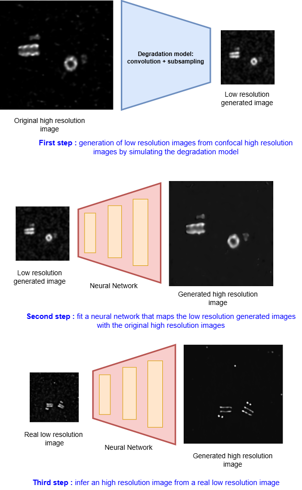

# Centriole Super Resolution

This repository contains the implementation of a deep learning-based super-resolution method aimed at enhancing wide-field fluorescence microscopy images to approximate confocal image quality. The project focuses on centriole imaging and builds upon existing methods in computational microscopy and image restoration. This readme file summarizes the goal and methodology of the project, for more details on usage of the code, the reader is reffered to the document *user_guide.pdf*

---

## 🧬 Context: Fluorescence Microscopy Imaging

Fluorescence microscopy is a widely used imaging technique in biology and medicine for visualizing specific structures within cells. It relies on the use of **fluorophores**—fluorescent molecules that bind to target structures and emit light when excited by a specific wavelength.

Images in fluorescence microscopy are not perfect captures of the actual object; instead, they are **convolutions of the true object with the Point Spread Function (PSF)** of the microscope. The PSF represents how a single point of light spreads in the imaging system, and its characteristics strongly affect image resolution. This makes the imaging process a **convolutional modality**, where the observed image is blurred by the inherent limitations of the optical system.

---

## ❓ Problem Statement

Among the most common acquisition techniques in fluorescence microscopy are:

- **Wide-Field Microscopy**: Fast and suitable for large-scale imaging, but suffers from lower resolution due to out-of-focus light.
- **Confocal Microscopy**: Provides higher-resolution images by rejecting out-of-focus light using pinholes, but is much slower and time-consuming for the biologist.

This trade-off presents a bottleneck in high-throughput biological imaging, especially when both speed and resolution are critical.

---

## 💡 Proposed Solution: Super-Resolution via Deep Learning

We propose a **deep learning-based super-resolution algorithm** to enhance wide-field microscopy images to the quality of confocal images. Unlike typical super-resolution tasks, we **do not have perfectly matched wide-field/confocal image pairs**. Therefore, we simulate these pairs using a **degradation model**.

### Degradation Model

To simulate wide-field images from confocal ones, we apply a **Gaussian convolution** to the high-resolution confocal images. The standard deviation of this Gaussian is computed from the PSFs of the wide-field and confocal modalities, mimicking the resolution loss that occurs in practice.

### Learning the Inverse Mapping

Once the synthetic wide-field images are generated:

- A **neural network is trained** to approximate the inverse of this degradation model.
- It learns to map the synthetic wide-field images back to their corresponding confocal images.
- The network is then **applied to real wide-field images**, where the ground truth confocal image is unknown.

This enables us to **recover high-resolution information** from low-resolution data without requiring time-intensive confocal imaging for every sample.

You can see bellow an illutsration of our methodology: 

---

## 🔍 Data Preparation

Wide-field patches used for training and testing were extracted from large microscopy images using a detection algorithm called **Topaz**. This step ensures that the model focuses on regions of interest containing centrioles, improving both the relevance and efficiency of training.

Topaz GitHub repository: [https://github.com/tbepler/topaz](https://github.com/tbepler/topaz)

---

## 📚 Acknowledgements

This work was inspired by the paper:  
**"Deep Learning-Based Point-Scanning Super-Resolution Imaging"**  
*Guo et al., Nature Methods, 2021*  
🔗 [https://www.nature.com/articles/s41592-021-01144-8](https://www.nature.com/articles/s41592-021-01144-8)

---
